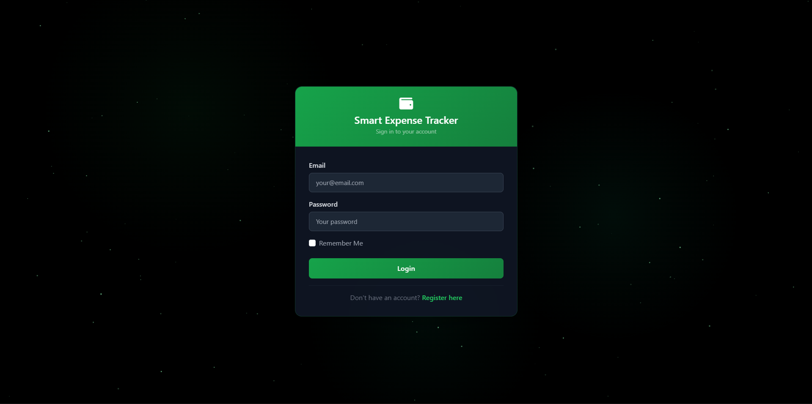
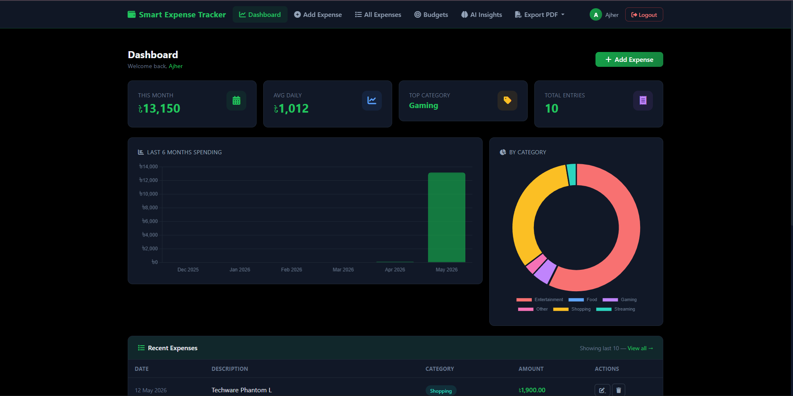
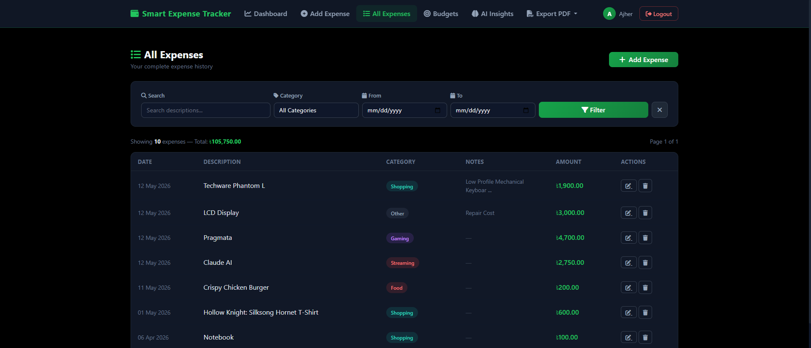
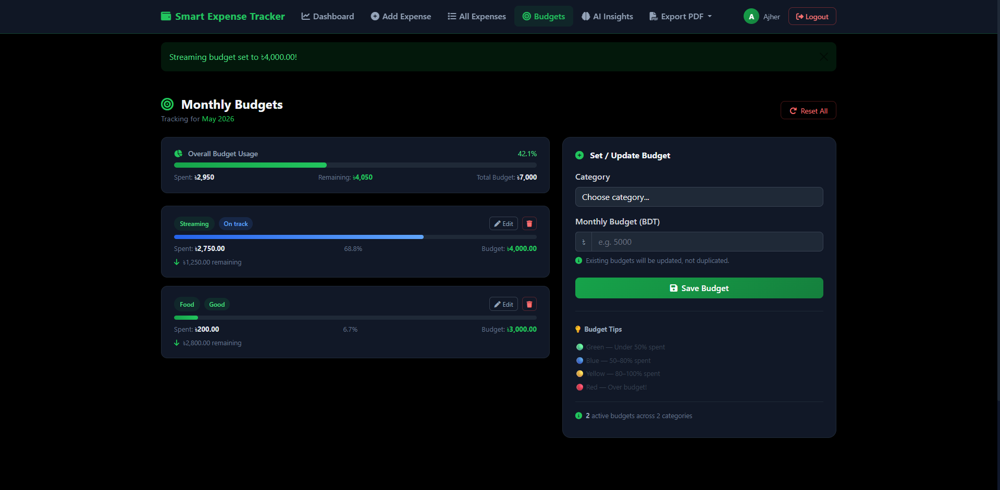
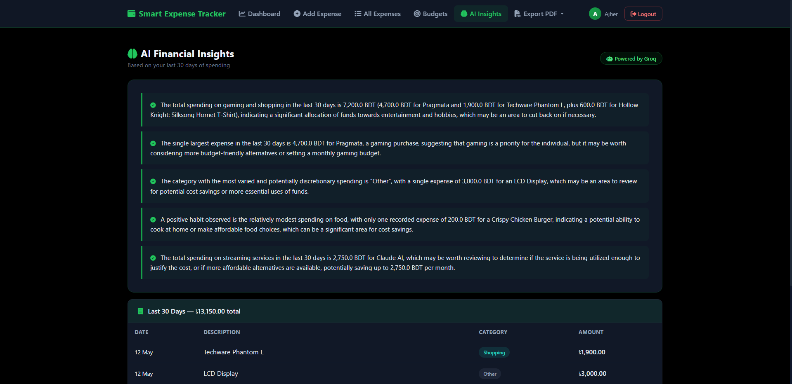

# 💸 Smart Expense Tracker

A full-stack personal finance web app built with **Flask** — featuring AI-powered expense categorization, budget management, spending insights, interactive dashboards, and PDF export.

---

## ✨ Features

| Feature | Description |
|---|---|
| **Auth System** | Register, login, logout, and profile management with Flask-Login |
| **Expense CRUD** | Add, edit, and delete expenses across 30 categories |
| **AI Auto-Categorization** | Groq (LLaMA 3.3-70B) automatically categorizes expenses when set to "Other" |
| **Dashboard** | Interactive Chart.js charts — monthly bar chart + category doughnut |
| **All Expenses** | Search, filter by category/date range, and paginate through all records |
| **Budget Manager** | Set monthly budget limits per category with live progress bars and warnings |
| **AI Insights** | Personalized 5-point spending analysis from your last 30 days of data |
| **PDF Export** | Export monthly or all-time expense reports as formatted PDFs |
| **Mobile Responsive** | Fully responsive UI across all screen sizes |

---

## 🛠️ Tech Stack

**Backend**
- [Flask](https://flask.palletsprojects.com/) — web framework
- [SQLAlchemy](https://www.sqlalchemy.org/) — ORM with SQLite
- [Flask-Login](https://flask-login.readthedocs.io/) — session-based authentication
- [Flask-WTF](https://flask-wtf.readthedocs.io/) — form validation and CSRF protection
- [Groq](https://groq.com/) — LLaMA 3.3-70B for AI categorization and insights
- [ReportLab](https://www.reportlab.com/) — PDF generation
- [Gunicorn](https://gunicorn.org/) — production WSGI server

**Frontend**
- Jinja2 templating
- [Chart.js](https://www.chartjs.org/) — interactive charts
- Custom CSS with mobile-first responsive design

---

## 🚀 Getting Started (Local Development)

### Prerequisites
- Python 3.10+
- A [Groq API key](https://console.groq.com) (free tier available)

### Setup

**1. Clone the repository**
```bash
git clone https://github.com/am-robin11/Smart-Expense-Tracker.git
cd Smart-Expense-Tracker
```

**2. Create and activate a virtual environment**
```bash
python -m venv venv
venv\Scripts\activate        # Windows
source venv/bin/activate     # macOS/Linux
```

**3. Install dependencies**
```bash
pip install -r requirements.txt
```

**4. Create a `.env` file in the project root**
```env
SECRET_KEY=your-secret-key-here
GROQ_API_KEY=your-groq-api-key-here
```

**5. Run the app**
```bash
python run.py
```

Visit `http://127.0.0.1:5000` in your browser.

---

## 🗂️ Project Structure

```
smart-expense-tracker/
├── app/
│   ├── __init__.py         # App factory
│   ├── models.py           # User, Expense, Budget models
│   ├── auth/
│   │   └── routes.py       # Register, login, logout, profile
│   └── expenses/
│       └── routes.py       # Dashboard, CRUD, budgets, insights, PDF
├── templates/
│   ├── base.html
│   ├── auth/               # login.html, register.html, profile.html
│   └── expenses/           # dashboard, all expenses, budgets, insights
├── static/
│   ├── css/
│   └── js/
├── config.py               # Environment-based configuration
├── run.py                  # App entry point
├── Dockerfile
└── requirements.txt
```

---

## 🤖 AI Features

Both AI features are powered by **Groq's LLaMA 3.3-70B** model:

- **Auto-categorization** — When adding an expense with category set to "Other", the app sends the description to Groq and automatically picks the best-fit category from the 30 available options.
- **AI Insights** — Analyzes your last 30 days of expense data and returns 5 personalized bullet points highlighting spending patterns, areas to cut back, and positive habits.

---

## 📸 Screenshots

### Login


### Dashboard


### All Expenses


### Budget Manager


### AI Insights


---

## 📄 License

This project is open source and available under the [MIT License](LICENSE).
